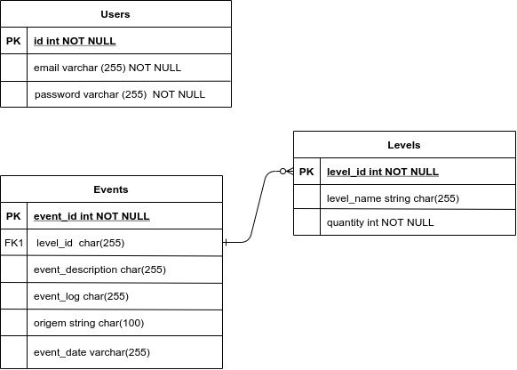

# Desafio Final da Aceleração Java

## Boas vindas ao repositório do Projeto - Central de Erros Api Java

Esse desafio foi proposto pela [Trybe](https://www.betrybe.com/) para a finalização da aceleração da Codenation, em que foram requisitadas habilidades necessáiras para desenvolver um projeto **Back-End** em Java. O resultado final é uma API para **gerenciar todos os erros** salvos num único banco de dados **SQL** através de uma **API RESTFull**.

### As ferramentas principais utilizadas foram:

[Java](https://www.java.com/pt-BR/)<br>
[Intelli J IDE](https://www.jetbrains.com/idea/)<br>
[Spring Boot](https://spring.io/projects/spring-boot)<br>
[Swagger](https://swagger.io/docs/)<br>

---

## Sumário

- [Contexto do *Case*](#contexto-do-case)
  - [Premissas](#premissas)
  - [Requisitos técnicos](#requisitos-técnicos)
- [Como rodar a aplicação](#como-rodar-a-aplicação)
  - [Clonando o Repositório](#clonando-o-repositório)
  - [Usando o link do deploy da API](#usando-o-link-do-deploy-da-api)
- [API](#api)
  - [Auth](#auth)
  - [Users](#users)
  - [Events](#events)
  - [Levels](#levels)
---

## Contexto do *Case*

*"Em projetos modernos é cada vez mais comum o uso de arquiteturas baseadas em serviços ou microsserviços. Nestes ambientes complexos, erros podem surgir em diferentes camadas da aplicação (backend, frontend, mobile, desktop) e mesmo em serviços distintos. Desta forma, é muito importante que os desenvolvedores possam centralizar todos os registros de erros em um local, de onde podem monitorar e tomar decisões mais acertadas. Neste projeto vamos implementar uma API Rest para centralizar registros de erros de aplicações."*

Abaixo estão as premissas e os requisitos técnicos que a solução deve possuir:

### Premissas

- [x] A API deve ser pensada para atender diretamente um front-end;
- [x] Deve ser capaz de gravar os logs de erro em um banco de dados relacional;
- [x] O acesso a ela deve ser permitido apenas por requisições que utilizem um token de acesso válido;


### Requisitos técnicos

- [x] Deve permitir a autenticação do sistema que deseja utilizar a API gerando o Token de Acesso;
- [x] Pode ser acessado por multiplos sistemas;
- [x] Deve permitir gravar registros de eventos de log salvando informações de **Level(error, warning, info), Descrição do Evento, LOG do Evento, ORIGEM(Sistema ou Serviço que originou o evento), DATA(Data do evento), QUANTIDADE(Quantidade de Eventos de mesmo tipo)**;
- [x] Deve permitir a listagem dos eventos juntamente com a filtragem de eventos por qualquer parâmetro especificado acima;
- [x] Deve suportar Paginação;
- [x] Deve suportar Ordenação por diferentes tipos de atributos;
- [x] A consulta de listagem **não deve retornar os LOGs** dos Eventos;
- [x] Deve permitir a busca de um evento por um ID, dessa maneira exibindo o LOG desse evento em específico;

## Como rodar a aplicação

### Clonando o repositório

Após cada um dos passos a seguir, haverá um exemplo do comando a ser digitado para fazer o que está sendo pedido, caso tenha dificuldades e o exemplo não seja suficiente, não hesite em me contatar em _eduardawiltiner@gmail.com_.

1. Abra o terminal e crie um diretório no local de sua preferência com o comando **mkdir**:
```javascript
  mkdir api-java
```

2. Entre no diretório que acabou de criar e depois clone o projeto:
```javascript
  cd central-error-api-java
  git clone https://github.com/dudawiltiner/central-error-api-java.git
```

### Rodando a aplicação pelo IntelliJ

3. Entre no diretório criado após a clonagem do repositório. No caso de uso do IntelliJ, rodea aplicação no arquivo, na pasta Main:
```javascript
  CentralErrorApiJavaApplication
```

### Rodando a aplicação pelo terminal usando Maven

4. Você pode usar o Maven instalado para rodar aplicação, digitando o seguinte comando:
```javascript
  mvn exec:java -Dexec.mainClass="api.centralerrorapijava.CentralErrorApiJavaApplication"
```

### Usando a API

5. Você pode usar a API pelo Postman usando o seu localhost na porta 8080:

```javascript
  http://localhost:8080/{rota}
```

Os verbos e cada rota podem ser consultados nessa secção do repositório: [API](#api) ou no link da documentação da API Swagger: ```https://api-error-java.herokuapp.com/swagger-ui.html```.

### Realizar testes na aplicação no IntelliJ

6. Vá até a pasta de testes e clique nos arquivo de testes. Agora você pode rodar.
```javascript
  EventServiceImplTest
```
Ou :

```javascript
  LevelErrorImplTest
```
### Usando o link do deploy da API

7. Você pode usar a API que já está no ar, hospedada no Heroku. Porém você precisa das credenciais. Sugiro apenas utilizar a API que está no ar para consultar a documentação através do link: ```https://api-error-java.herokuapp.com/swagger-ui.html```.

## API

A Api é composta por quatro rotas(**events, levels, users e auth**). Todas com suas respectivas consultas as tabelas no banco de dados. Um arquivo sql na pasta src/main/resources é carregado quando a aplicação é incializada populando o banco de dados na tabela User para se ter um usário para a autenticação e também popular a tabela Levels, contendo todos os níveis de erros e registrando cada quantidade, ela vai ter um relacionamento com a tabela Events para identificação dos níveis de erros e suas pespectiavs quantidades para cada evento buscado nas requisições.

Para entender melhor abaixo está uma imagem do Diagrama ER(Entidade Relacionamento).

<div align="center">
  
</div>

###
Logo abaixo, para cada rota da API foi feita uma tabela explicando. Porém, a documentação de todas as rotas e muito mais como usa-las você pode encontrar, após incializar aplicação, através da rota: ```/swagger-ui.html``` carregada no seu próprio browser ou usando a API hospedada no Heroku: ```https://api-error-java.herokuapp.com/swagger-ui.html```.

### Auth


| MÉTODO |        ROTA     |                       DESCRIÇÃO                       |                                                                                 REQUISIÇÃO(VALUES)                                                                                 |                       RESPOSTA                       |
|:------:|:------------:|:-----------------------------------------------------:|:----------------------------------------------------------------------------------------------------------------------------------------------------------------------------------:|:----------------------------------------------------:|
|  POST  | /oauth/token | Rota para verificar o sistema e autenticar o usuário. | Devem ser colocadas as credenciais que estão no arquivo /src/main/resources/application.properties e para gerar o token, colocar o login e senha do usuário cadastro no banco de dados.  | Retorna um json com o "acess-token"(token de acesso) |


### Users


| MÉTODO |  ROTA  |              DESCRIÇÃO              |             REQUISIÇÃO(VALUES)             |               RESPOSTA              |
|:------:|:-----:|:-----------------------------------:|:------------------------------------------:|:-----------------------------------:|
|  POST  | /user | Rota para cadastrar um novo usuário | Deve receber um json com o email e a senha | Retorna uma mensagem de confirmação |

### Events

| MÉTODO |                   ROTA                   |                       DESCRIÇÃO                       |                                                                                                                                          REQUISIÇÃO(VALUES)                                                                                                                                          |                       RESPOSTA                       |
|:------:|:----------------------------------------:|:-----------------------------------------------------:|:----------------------------------------------------------------------------------------------------------------------------------------------------------------------------------------------------------------------------------------------------------------------------------------------------:|:----------------------------------------------------:|
|  POST  |                  /events                 |          Rota para salvar um evento de erro.          | Deve receber um json no body que contenha a data do evento, a descrição, o seu log, o id correspondente do nível do erro e a origem( ex: ``` {     "eventDescription": "descricao1",  "eventLog": "log1",  "eventDate": "01-04-2021",   "level": {       "id": 2   },   "origin": "sistema1" } ```). |          Retorna uma mensagem de confirmação         |
|   GET  |                  /events                 |           Rota para listar todos os eventos.          |                                                                                                                                                   -                                                                                                                                                  |     Retorna uma lista/array com todos os eventos.    |
|   GET  |               /events/{id}               |         Rota para encontrar um evento pelo id.        |                                                                                                                    Deve receber como um parâmetro de pasta o id do evento(ex: 1).                                                                                                                    |              Retorna um eventos pelo id.             |
|   GET  |        /events/byDate/{eventDate}        |    Rota para filtrar a lista de eventos pela data.    |                                                                                                               Deve receber como um parâmetro de pasta a data do evento(ex: 02-03-2021).                                                                                                              |      Retorna uma lista/array filtrada pela data.     |
|   GET  | /events/byDescription/{eventDescription} |  Rota para filtrar a lista de eventos pela descrção.  |                                                                                                             Deve receber como um parâmetro de pasta a decrição do evento(ex: descricao1).                                                                                                            |   Retorna uma lista/array filtrada pela descrição.   |
|   GET  |        /events/byLevel/{levelName}       |    Rota para filtrar a lista de eventos pelo nome.    |                                                                                                              Deve receber como um parâmetro de pasta o nome do nível do erro(ex: info).                                                                                                              | Retorna uma lista/array filtrada pelo nível do erro. |
|   GET  |       /events/byQuantity/{quantity}      | Rota para filtrar a lista de eventos pela quantidade. |                                                                                                          Deve receber como um parâmetro de pasta a quantidade de erros de um nível(ex: 10).                                                                                                          |   Retorna uma lista/array filtrada pela quantidade.  |
|   GET  |         /events/byOrigin/{origin}        |   Rota para filtrar a lista de eventos pela origem.   |                                                                                                              Deve receber como um parâmetro de pasta a origem do evento(ex:  sistema1).                                                                                                              |     Retorna uma lista/array filtrada pela origem.    |

Em todas as rotas de método GET você pode aplicar paginação e ordenação para todos os campus, menos a quantidade e o nível de cada erro. Ex: ```/rota?page=0&size=3&sort=origin```.

### Levels


| MÉTODO |   ROTA  |                                 DESCRIÇÃO                                | REQUISIÇÃO(VALUES) |                         RESPOSTA                         |
|:------:|:-------:|:------------------------------------------------------------------------:|:------------------:|:--------------------------------------------------------:|
|   GET  | /levels | Rota para listar todos os níveis de erros e suas respectivas quantidades |          -         | Retorna uma lista/array com todos os níveis cadastrados. |
